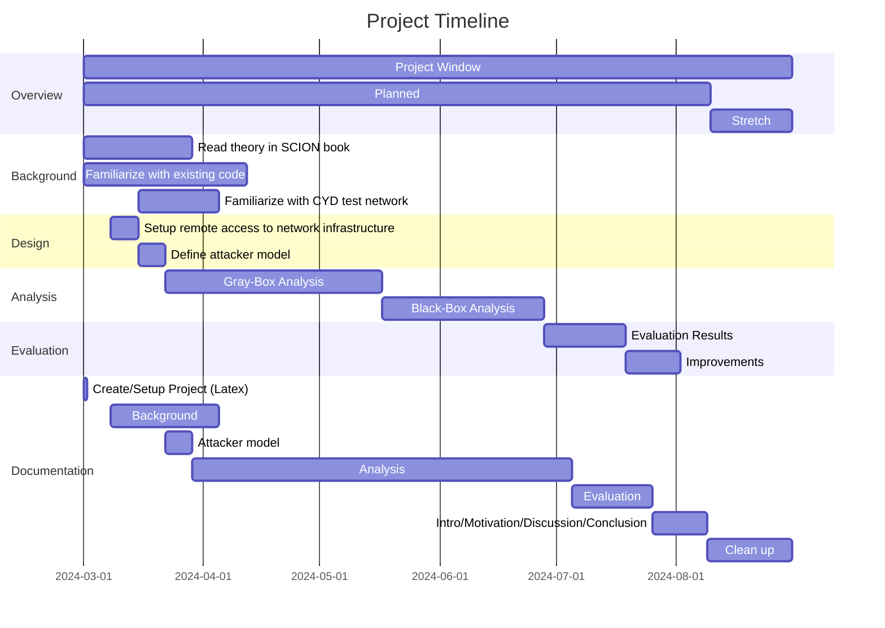

# Timeline

*This should contain the timeline, which can be defined as a Gantt chart using [mermaid](https://mermaid-js.github.io/mermaid/).*



# Usage
1. Clone the repository
```bash
git clone --recurse-submodules <repository-url>
```

# Template for a student project repository

This repository serves as the template for every student project at the CYD campus.

Important notes:

* *Naming convention:* The name of the project repository should follow this format:
`[year]_[student first name]-[student last name]_[project name]` (e.g., `2023_Max-Muster_Making-everything-secure`)

* *Structure:* The repository comes with a predefined directory structure. This should be used in general, but it can be extended with additional folders as needed.

* *No classified information:* It is not allowed to use GitHub to store classified contents. Classified projects must not use GitHub.

* *During the project:* It is up to the student(s) and advisor(s) to define how GitHub should be used during the project (e.g., it is possible to use Overleaf for the report). However, at the end of the project, all contents need to be on GitHub (see below).

* *At the end of the project:* Make sure that the following data is in the repository:
    - Latest version of source code and documentation (if available)
    - Final report (in PDF and raw format (e.g., LaTeX or Word))
    - Final presentation (in PDF and raw format (e.g., LaTeX or PowerPoint))

* *Repository remains private:* This repository remains private (i.e., only accessible for specific users). If code should be made open source, this needs to happen in a separate repository. The student loses access to the repository after the project ends.
